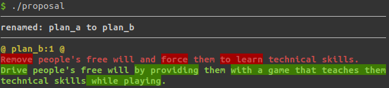

Success is a matter of choice.

We remove the failing options.

---

### How Well Do You Know IT?

Take the classic game, Snake.

+++

### What's Your Level?

* **User** &mdash; Played the game.
* **Editor** &mdash; Can blog about it.
* **Developer** &mdash; Has implemented a clone.
* **Experienced** &mdash; Runs a highly available distributed gaming service.

---

### The Problem

Research says there's an IT skills gap.

<small><small>https://digitalskillsforum.files.wordpress.com/2017/12/digital_skills_report-online-2017-dec.pdf</small></small>

+++

### Dealing With It

We dish out visas for IT:

<small><small>http://skillshortages.immigration.govt.nz/software-engineer</small></small>

---

### The Other Problem

We have technology addiction.

---

### The Question

How can we be addicted to technology, yet be able to control it.

---

### The Proposal

+++

If people are going to be addicted to technology, let's drive that addiction to good use.
