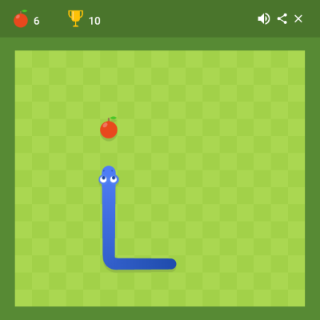

Success is a matter of choice.

We remove the failing options.

---

### How Well Do You Know IT?

Take the classic game, Snake.



+++

### What's Your Level?

* **User** &mdash; Played the game.
* **Editor** &mdash; Blogged about it.
* **Developer** &mdash; Has implemented a clone.
* **Elite** &mdash; Runs a highly available secure gaming service with DDoS protection.

---

### The Problem

Research says there's an IT skills gap.

<small><small>https://digitalskillsforum.files.wordpress.com/2017/12/digital_skills_report-online-2017-dec.pdf</small></small>

+++

### Dealing With It

We dish out visas:


<small><small>http://skillshortages.immigration.govt.nz/software-engineer</small></small>

---

### The Other Problem


We have technology addiction.

---

### The Question

How can so many of us be addicted to technology, yet only a fraction are able to masterfully control it?

---

### The Proposal


If people are going to be addicted to technology, let's direct that addiction to good use.

+++

### Imagination Into Reality


People enjoy creating things.

+++

### Prior Art


*Warcraft* and *The Elder Scrolls: Skyrim* have a steep learning curve, and so modding is typically done by more earnest fans.

+++

### Simplicity Is Best


Minecraft is successful because *creation is the game*, and it is simple for kids and adults to create.

+++

### Balance


The solution to aim for is somewhere in between &mdash; simple to mod, yet technically edifying.

---

### Plan

1. Implement a 2.5D multiplayer action player-vs-player (PVP) game.
2. Modding as a first class concept.
3. Easy sharing with other players.
4. Provide high quality resources to encourage modding.

+++

### 2.5D Multiplayer PVP

* Multiplayer PVP games are fun.
* 2D Sprites (characters)

    You don't neet a powerful computer to run the game; people with basic computers can join.

* It doesn't take a prodigy to create 2D sprites.

    These can be created with free software such as Paint.NET, and Krita.

+++

### Modding

Many streams exist, each training a different skill:

* **Sprites:** Graphical art.
* **Character behaviour:** Configuration and user experience.
* **Scripted AI:** Programming and troubleshooting.
* **Story:** Literacy fluency.

+++

### Platform

The game will be written for PC, compatible across major OSes (Windows, Linux, OS X). The most common technical tasks are not practically done on a touch screen, so we target the lowest common denominator.

---

### Prototype


A prototype is in active development, written in Rust<sup>1</sup>.

<small><small><sup>1</sup> https://www.rust-lang.org/</small></small>

+++

### Sprites


There are a set of example sprites with poses that are used by the game.

+++

### Character Configuration

```toml
[sequences.walk]
  frames = [
    { sheet = 0, sprite = 0, wait = 2 },
    { sheet = 0, sprite = 1, wait = 2 },
    { sheet = 0, sprite = 2, wait = 2 },
    { sheet = 0, sprite = 3, wait = 2 },
    { sheet = 0, sprite = 4, wait = 2 },
  ]
```

Configuration is in a non-complicated text format. This introduces players to software configuration, but the gaming aspect helps to maintain their interest.

---

### Ongoing Work

Work is ongoing to get a minimal release to find the optimal balance between ease of creation against technical challenge.

---

## Thanks For Viewing
